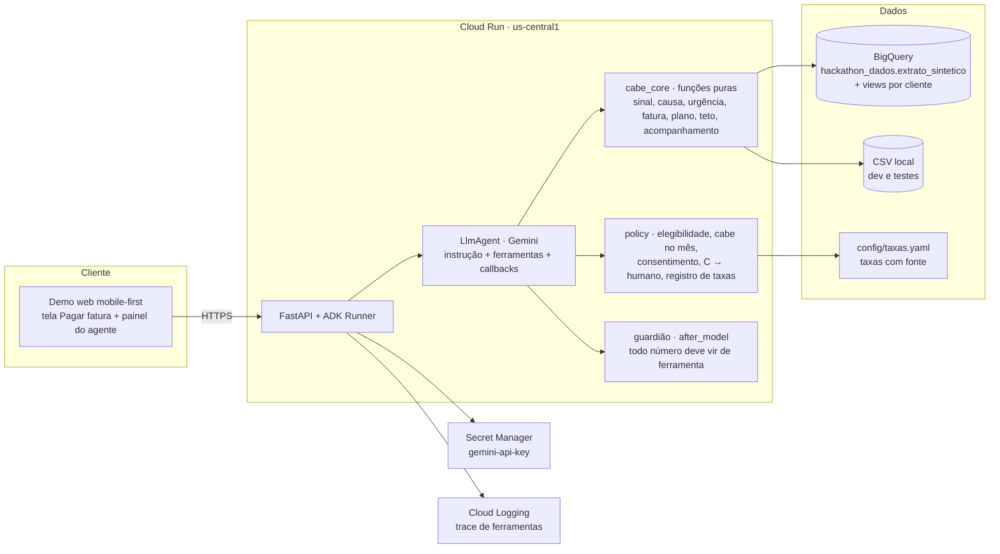

# 04 · Arquitetura na GCP (entregável)

Princípio: **tudo que é número é código; o LLM explica, pergunta e conduz.** Um agente ADK com ferramentas determinísticas, um guardião que valida cada resposta, dados no BigQuery, serviço no Cloud Run, demo web com QR code.

## Componentes



## Camadas

### 1. Dados (BigQuery)
- Tabela fornecida: `batalha-time-05-xew3.hackathon_dados.extrato_sintetico` (us-central1). Espelho local: `data/extrato_sintetico.csv.gz`.
- Views a criar (uma consulta agregada por cliente, nunca em loop):
  - `v_cliente_mes`: renda, salário e dia, PIX recebido, contas fixas, gasto no cartão, delivery+app, por `id_usuario` e `anomes`.
  - `v_fatura`: pagamento de fatura por mês com `modo` (integral/parcial/mínimo), juros do mês e `fatura_estimada` por modo: integral = `pago`; mínimo = `pago/0,15`; parcial = `pago + juros/0,14`. Nos meses integrais, os juros são de cheque especial e não entram na fatura.
  - `v_perfil`: flags de perfil (CLT, INSS, financiamento, aluguel pago/recebido), meses rolados, maior sequência, grupo A/B/C, causa.
- Em dev e nos testes, as mesmas agregações rodam sobre o CSV (pandas). A interface das ferramentas é a mesma.

### 2. Núcleo determinístico (`cabe_core`, Python puro, testado)
Dinheiro em centavos (int). Nenhuma chamada de rede. Cada função retorna dict serializável com os números e a origem de cada um.

| Função | Entrada | Saída |
|---|---|---|
| `detectar_sinal(cliente, mes, acao)` | histórico + ação na tela (escolheu pagar menos que o total; simulou N vezes) | `{sinal: bool, motivo, fatura, fatura_pct_renda, faturas_roladas_seguidas}` |
| `diagnosticar_causa(cliente)` | 12 meses | `{causa: renda_comprometida / gasto_dia_a_dia / gasto_atipico / renda_irregular / sem_causa, evidencias[]}` |
| `classificar_urgencia(cliente)` | modos de pagamento do ano | `{grupo: A/B/C, meses_rolados, maior_sequencia}` |
| `reconstruir_fatura(pago, juros, modo)` | valores do mês | `fatura` |
| `sobra_do_mes(cliente, mes, contar_pix)` | renda, fixos, essenciais | `{sobra, essenciais, incerto_pix}` |
| `montar_plano(cliente, fatura, sobra, grupo, causa, taxas, elegibilidade)` | tudo acima | `{pagar_agora, restante, opcoes[]: {produto, taxa, n, parcela, juros_total, cabe: bool}, recomendada, teto_mes, termina_em}` |
| `simular_rotativo(restante, meses)` | 14% a.m. da base | custo se continuar rolando |
| `acompanhar(plano, mes_seguinte)` | fatura e pagamento do mês seguinte | `{coube: bool, ajuste, faturas_inteiras_seguidas, encerrar: bool}` |

Regras fixas em `policy.py`: parcela recomendada ≤ sobra livre; se nenhuma opção cabe, sem crédito e encaminhar humano; grupo C nunca recebe crédito automático; consignado só com elegibilidade explícita; taxas só de `config/taxas.yaml`; consentimento registrado antes de qualquer leitura de histórico.

### 3. Agente (Google ADK, Python)
- `LlmAgent` (`from google.adk.agents import LlmAgent`), modelo Gemini disponibilizado pelo evento (o guia cita `gemini-3.8-flash`; conferir o nome exato na Agent Platform do projeto). Chave via Secret Manager (`gemini-api-key`) ou ADC na Agent Platform.
- `tools`: as funções do núcleo, expostas como function tools (docstring e type hints; retorno dict).
- `instruction`: papel, tom (ver `06-design-system-ai.md`), regra de ouro ("todo número vem de ferramenta; se não tiver, pergunte ou diga que não sabe"), fluxo em seis etapas, quando parar e chamar humano.
- Callbacks:
  - `before_tool_callback`: bloqueia leitura de histórico sem `state["consentimento"] == True`.
  - `after_model_callback` (guardião): extrai valores monetários e percentuais da resposta e confere contra o conjunto de números produzidos pelas ferramentas na sessão; se houver número sem origem, reescreve a resposta pedindo confirmação ou remove o número. Bloqueia menção a produtos fora do plano (seguro, cashback).
  - `after_tool_callback`: registra cada chamada no trace exibido no painel "como cheguei aqui".
- Estado de sessão: `cliente_id`, `consentimento`, `mes_simulado`, `plano`, `numeros_validados`.
- Sem LLM no acompanhamento mensal: é um job determinístico que só aciona o agente quando há o que conversar.

### 4. Serviço (Cloud Run)
- FastAPI com o ADK Runner; endpoints: `POST /sessao`, `POST /mensagem`, `POST /avancar-mes` (simulação), `GET /trace/{sessao}`.
- Demo web estática servida pelo mesmo serviço (`/`), mobile-first, com QR code apontando para a URL do Cloud Run.
- Deploy: Cloud Build → Artifact Registry (`agentes`) → `gcloud run deploy cabe-no-bolso --region=us-central1 --max-instances=5 --allow-unauthenticated`. Limitar concorrência e `max-instances` (DoS e custo).
- Variáveis: `GOOGLE_CLOUD_PROJECT=batalha-time-05-xew3`, `DADOS=bigquery|csv`, `TAXAS=config/taxas.yaml`.

### 5. Observabilidade e segurança
- Cloud Logging com o trace das ferramentas por sessão; o mesmo trace alimenta o painel da banca.
- Dados sintéticos: nenhum PII. Em produção: minimização, retenção curta, consentimento por finalidade.
- Descrições de transação e mensagens do usuário são dados, nunca instruções (prompt injection). O guardião não deixa passar número inventado.
- Sem chaves no repositório; ADC local com `gcloud config configurations activate mana-gsoares`.

## Determinístico x LLM

| Passo | Quem faz |
|---|---|
| Detectar sinal, classificar urgência, reconstruir fatura, calcular sobra, montar opções, teto, acompanhar | Código |
| Elegibilidade, taxas, limites de parcela, encaminhar humano | Código + config |
| Escolher a pergunta certa (PIX é renda? houve gasto atípico?), explicar em linguagem simples, conduzir a conversa, adaptar tom | LLM |
| Validar a resposta antes de sair | Código (guardião) |

## Sequência da demo

```mermaid
sequenceDiagram
  participant U as Cliente (banca via QR)
  participant W as Demo web
  participant A as Agente ADK
  participant C as cabe_core
  U->>W: abre Pagar fatura (fev/2025), escolhe pagar o mínimo
  W->>A: evento {cliente, mes, acao: pagar_menos}
  A->>C: detectar_sinal → fatura R$ 7.612 = 2x a renda; sinal = true
  A-->>U: pede consentimento
  U-->>A: autoriza
  A->>C: diagnosticar_causa → gasto atípico (jan–fev) + delivery/app 20% da renda
  A->>C: classificar_urgencia → B
  A-->>U: pergunta: a compra de janeiro foi planejada? há entrada extra prevista?
  A->>C: sobra_do_mes, montar_plano (taxas de config/taxas.yaml)
  A-->>U: duas saídas com custo; recomendada; teto do mês
  U-->>A: escolhe o plano
  U->>W: avançar mês (mar, abr)
  A->>C: acompanhar → coube; faturas inteiras seguidas
  A-->>U: progresso e encerramento
  U->>W: abre "como cheguei aqui" (trace)
```

## Custo

BigQuery: views agregadas, uma leitura por cliente por sessão, cache em memória; nada em loop. Gemini: modelo flash; poucas chamadas por sessão (5 a 8). Cloud Run: escala a zero. Orçamento do grupo: US$ 1.000; Antigravity e Gemini CLI consomem do mesmo orçamento.

## Referências
- Google ADK (Python): https://adk.dev (agents/llm-agents, callbacks/types-of-callbacks).
- Guia de onboarding do evento: `fontes/oficiais/guia-gcp-onboarding.svg`.
