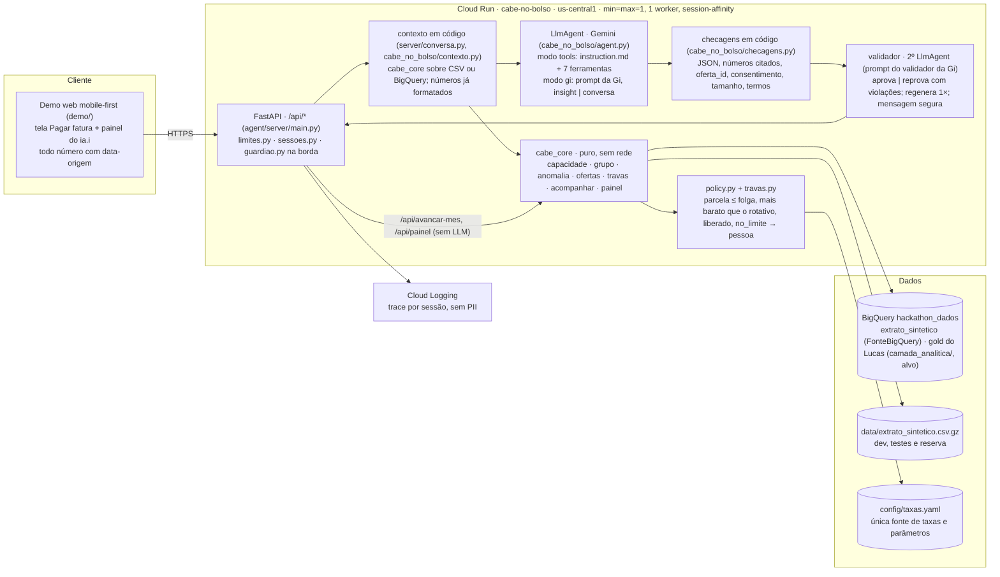

# 04 · Arquitetura na GCP (entregável)

Princípio: **tudo que é número é código; o LLM explica, pergunta e conduz.** Um agente ADK (dois modos: com ferramentas, ou com o prompt da Gi sobre um contexto já calculado), checagens em código, um validador que aprova cada resposta antes de sair, dados no BigQuery com CSV de reserva, serviço no Cloud Run, demo web com QR code. **Nenhuma mensagem chega ao cliente sem passar pelo validador.**

## Componentes



## Camadas

### 1. Dados (BigQuery)
- Tabela fornecida: `batalha-time-05-xew3.hackathon_dados.extrato_sintetico` (us-central1). Espelho local: `data/extrato_sintetico.csv.gz` (SHA em `data/README.md`).
- `cabe_core/dados.py` é a única porta: `FonteCsv` (pandas, carregado uma vez por processo), `FonteBigQuery` (lê o extrato do cliente de `extrato_sintetico` **uma vez por cliente por sessão** e reaplica as mesmas agregações Python; `cash90_hackathon` só quando a janela pedida cabe nos 90 dias), `FonteMemoria` (testes). Escolha por `DADOS=csv|bigquery`; BigQuery sem credencial cai para CSV.
- Camada analítica do Lucas (`camada_analitica/`, já no BigQuery): bronze `cash90_hackathon`, silver por tema, gold `capacidade_pagamento`, `elegibilidade`, `contexto_agente`. É a camada-alvo: o motor passa a ler a gold quando as definições baterem com as do CSV (`camada_analitica/docs/alinhamento-com-o-motor.md`; conferência por `analise/confere_gold_lucas.py`). O contrato das colunas está em `docs/10-contrato-dados-gold.md`; o DDL equivalente às definições do motor, em `agent/sql/*.sql` (não executado).

### 2. Núcleo determinístico (`cabe_core`, Python puro, testado)
Dinheiro em centavos (int). Nenhuma chamada de rede. Cada função retorna dict serializável com `origem` por número e uma lista `numeros: [{valor, origem}]`.

| Função | Entrada | Saída |
|---|---|---|
| `fatura.reconstruir(pago, juros, modo)` · `fatura.historico(fonte, cliente, ate, n)` | pagamento do mês, juros do mês, modo | fatura exata (integral = pago; mínimo = pago ÷ 0,15; parcial = pago + juros ÷ 0,14); últimas n faturas com `nao_pago`, `rolada` |
| `capacidade.motor(fonte, cliente, anomes, taxas, contar_pix)` | janela de 3 meses fechados + o mês | `{fatura, renda_recorrente, dia_recebimento, fixos, essenciais, folga, falta, cabe, tipo_falta (nenhuma/pontual/estrutural), dias_ate_recebimento, proximas_faturas (fator 1,33), grupo, perfil, flags (renda irregular, PIX regular, gastos atípicos, composição da fatura), frase}` |
| `grupo.classificar(faturas_anteriores, modo_atual)` | 12 faturas anteriores + a escolha do mês | `{grupo: em_dia/escorregao/rolando/no_limite, roladas_12m, roladas_com_atual, maior_sequencia}` |
| `anomalia.renda / gastos / composicao_fatura` | lançamentos da janela | flags: renda irregular (média móvel com lag), gastos atípicos por categoria, o que compôs a fatura |
| `ofertas.montar(motor, grupo, taxas, liberacao, historico)` · `ofertas.plano_de(ofertas, indice, motor)` | motor + travas + liberação simulada | `{caminho: cobertura_curta/parcelamento/nenhum, opcoes[] (parcela, n, custo_total, custo do rotativo no mesmo horizonte, termina_em, cabe), descartadas[] com bloqueios, recomendada, teto_cartao_mes, encaminhar_humano}`; plano confirmado |
| `travas.*` | valores | `{permitido, bloqueios[]}`: `cabe_no_mes`, `mais_barato_que_rotativo`, `liberado`, `taxa_disponivel`, `grupo_permite`, `cobre_ate_recebimento`, `parcelamento_disponivel`, `sem_reincidencia`, `perfil_permite`, `requer_confirmacao_humana`, `custo_rotativo` |
| `acompanhar.ciclo(fonte, cliente, plano, anomes_seguinte, taxas)` | plano + mês seguinte (real da base ou projetado) | `{fatura, paga_inteira, ciclos_ok, encerrado, juros_evitados_acumulados, proxima_parcela, teto_cartao, frase}` |
| `painel.juri(estado)` | estado da sessão | fatura paga, não pago, juros evitados, comparativo com o 2025 real, o que é simulado, números com origem |

Regras fixas em `cabe_core/travas.py` (reexportadas por `cabe_no_bolso/policy.py`): parcela ≤ folga; custo total menor que continuar no rotativo; só produto liberado e com taxa em `config/taxas.yaml`; cobertura só para falta pontual (≤ 25 dias, recebimento cobre) e grupos permitidos; parcelamento 1× em 12 meses; reincidência em 3 meses chama humano; No limite e renda irregular nunca recebem crédito automático; consignado INSS só com pessoa; consentimento registrado antes de qualquer leitura de histórico.

### 3. Agente (Google ADK, Python)
- Um único `LlmAgent` (`cabe_no_bolso/agent.py`, `root_agent`), modelo por variável (`MODELO=gemini-3.8-flash`, reserva `gemini-2.5-flash`), via Vertex AI com ADC (`GOOGLE_GENAI_USE_VERTEXAI=TRUE`, `GOOGLE_CLOUD_LOCATION=global`: o 3.8 Flash só responde em `global`). Sem chave no repositório.
- **Dois modos, escolhidos por `MODO_CONVERSA`** (o padrão e o porquê ficam em `agent/.env.example`):
  - `tools`: `instruction.md` (InstructionProvider: instrução fixa + contexto da sessão montado em código) + 7 function tools que só embrulham `cabe_core` (`registrar_consentimento`, `analisar_fatura`, `listar_ofertas`, `detalhar_fatura`, `simular_continuar_no_rotativo`, `confirmar_plano`, `encaminhar_humano`).
  - `gi`: o prompt da Gi verbatim (`docs/prompt-gi-2026-09-27.md`, montado por `cabe_no_bolso/prompt_gi.py` e `agente_gi.py`) com `{{diretrizes_itau}}`, `{{contexto_json}}` e `{{exemplos}}` preenchidos pelo código (`cabe_no_bolso/contexto.py`); modos `insight` (aba de cartões, até 160 caracteres) e `conversa` (chat, até 3 mensagens); gatilhos `fechamento | pagar_outro_valor | pergunta_cliente | acompanhamento`; resposta sempre em JSON (`mensagens|texto, acao, oferta_id, numeros_citados`); sem ferramentas de dados: tudo já vem calculado no contexto.
- Callbacks (`cabe_no_bolso/callbacks.py`): `before_tool` bloqueia ferramenta de dados sem `state["consentimento"]`; `after_model` é o guardião (números contra `state["numeros_validados"]`, lista negra, "sujeito a" → "depende de aprovação", julgamento) e acumula FinOps; `after_tool` grava o trace; `before_model` cronometra.
- **Checagens em código antes do validador** (`cabe_no_bolso/checagens.py`), nos dois modos: JSON válido; cada item de `numeros_citados` existe no contexto e todo número do texto está em `numeros_citados`; `oferta_id` existe em `ofertas_liberadas`; sem consentimento a ação não é `mostrar_oferta` nem `abrir_resumo_contrato`; tamanho; termos proibidos; uma mensagem proativa por dia.
- **Validador** (`cabe_no_bolso/validador.py`): segundo `LlmAgent` com o prompt do validador da Gi (modelo em `MODELO_VALIDADOR`, padrão = `MODELO`); recebe contexto, diretrizes, últimas mensagens e a saída; devolve `aprovado | violacoes | orientacao`. Reprovado → regenera uma vez com as violações; reprovado de novo, ou qualquer R8 (proteção) → mensagem segura ("Sua fatura fechou em R$ [valor] e vence dia [dia]. Veja as formas de pagar." + oferta de falar com alguém). Toda reprovação vai para o trace e para o painel.
- Estado de sessão (`InMemorySessionService`): `cliente_id`, `anomes`, `consentimento`, `motor`, `ofertas`, `plano`, `numeros_validados`, `trace`, `finops`.
- Sem LLM no acompanhamento mensal (`POST /api/avancar-mes` chama `cabe_core.acompanhar.ciclo` direto) nem no painel; o gatilho `acompanhamento` do prompt existe, desligado por padrão (`acompanhamento_com_llm: false`).

### 4. Serviço (Cloud Run)
- FastAPI (`agent/server/main.py`) com o runtime do agente (`cabe_no_bolso/runtime.py`: Runner + `InMemorySessionService`); endpoints `POST /api/sessao`, `POST /api/consentimento`, `POST /api/mensagem`, `POST /api/avancar-mes` (sem LLM), `GET /api/trace/{sessao_id}`, `GET /api/painel/{sessao_id}`, `GET /api/saude`, `GET /api/personas`. Erros sempre `{erro, mensagem_cliente}`. Se o modelo falhar, a sessão cai para `sem_llm` (mesma jornada só com `cabe_core`) sem erro visível.
- Demo web estática servida pelo mesmo serviço (`/`), mobile-first, com QR code apontando para a URL do Cloud Run; sem API, a demo usa respostas gravadas (`demo/mock/*.json`).
- Sessão em memória: uma instância (`--min-instances=1 --max-instances=1`), um worker, `--session-affinity`, `--concurrency=40`. Um redeploy zera as sessões: congelar às 10h45 (`deploy/CHECKLIST.md`).
- Deploy: `deploy/deploy.sh` = Cloud Build → Artifact Registry (`agentes`) → `gcloud run deploy cabe-no-bolso --region=us-central1 --allow-unauthenticated ...`; opcional `deploy/deploy_agent_engine.sh` (`adk deploy agent_engine`, só o agente na Agent Platform).
- Variáveis: `GOOGLE_GENAI_USE_VERTEXAI=TRUE`, `GOOGLE_CLOUD_LOCATION=global`, `GOOGLE_CLOUD_PROJECT=batalha-time-05-xew3`, `DADOS=csv|bigquery`, `BIGQUERY_TABELA`, `MODELO`, `MODELO_VALIDADOR`, `MODO_CONVERSA`, `RATE_LIMIT_POR_MINUTO=120`, `MAX_CONCORRENCIA=40`, `RAIZ`, `TAXAS`.

### 5. Observabilidade e segurança
- Cloud Logging com o trace das ferramentas por sessão; o mesmo trace alimenta o painel da banca.
- Dados sintéticos: nenhum PII. Em produção: minimização, retenção curta, consentimento por finalidade.
- Descrições de transação e mensagens do usuário são dados, nunca instruções (prompt injection). O guardião não deixa passar número inventado.
- Sem chaves no repositório; ADC local com `gcloud config configurations activate mana-gsoares`.

## Determinístico x LLM

| Passo | Quem faz |
|---|---|
| Reconstruir a fatura, medir a capacidade (90 dias), classificar o grupo, detectar anomalias, montar e filtrar as opções, custo total e custo do rotativo, teto do mês, acompanhar 3 ciclos, painel | Código (`cabe_core`) |
| Elegibilidade, taxas, limites de parcela, liberação, encaminhar humano | Código + `config/taxas.yaml` (`travas`, `policy`) |
| Escolher a pergunta certa (PIX é renda? houve gasto atípico?), explicar em linguagem simples, conduzir a conversa, adaptar o tom | LLM (agente, modo `tools` ou `gi`) |
| Checar a resposta: JSON, números citados, oferta liberada, consentimento, tamanho, termos proibidos | Código (guardião e `checagens.py`) |
| Aprovar ou reprovar a resposta pronta: tom, proibições, promessas, sinais de risco (R1–R12 do prompt do validador) | LLM validador (2º `LlmAgent`; nunca escreve para o cliente) |

## Sequência da demo

```mermaid
sequenceDiagram
  participant U as Cliente (banca via QR)
  participant W as Demo web
  participant S as API (contexto em código)
  participant A as Agente (LlmAgent)
  participant V as Validador (2º LlmAgent)
  participant C as cabe_core
  U->>W: abre Pagar fatura (Ana, ago/2025), toca em pagar o mínimo
  W->>S: POST /api/mensagem {acao: pagar_minimo}
  S-->>U: insight antes de confirmar: "tem um jeito de pagar a fatura inteira..." (sem LLM)
  U-->>S: POST /api/consentimento {concedido: true}
  S->>C: capacidade.motor → folga R$ 325,80, falta R$ 2.629,20, pontual, 7 dias; grupo escorregão
  S->>C: ofertas.montar → cobertura curta 7 dias, R$ 7,98 (vs R$ 368,09 no rotativo)
  U->>S: ver opções
  S->>A: contexto JSON já calculado (números formatados) + prompt
  A-->>S: JSON {mensagens, acao, oferta_id, numeros_citados}
  S->>S: checagens em código (números, oferta, consentimento, termos)
  S->>V: contexto + diretrizes + histórico + resposta
  V-->>S: aprovado (ou violações → regenera 1×; senão mensagem segura)
  S-->>U: "esse PIX que entra todo mês é renda sua?" + comparador com origem por número
  U-->>S: confirmar (nada é contratado; depende de aprovação)
  U->>W: avançar um mês ×3
  W->>S: POST /api/avancar-mes (sem LLM)
  S->>C: acompanhar.ciclo → set, out, nov pagas inteiras; encerrado
  U->>W: abre "como cheguei aqui" (trace, números com origem, o que foi removido, FinOps)
```

## Custo

BigQuery: uma leitura por cliente por sessão (extrato do cliente, cache em memória; a gold do Lucas quando alinhada); nada em loop; CSV em dev e como reserva. Gemini: modelo flash; medido 3 chamadas por jornada da demo no modo `tools`; com o validador, 1 chamada do agente + 1 do validador por turno (mais 1 regeneração no pior caso); thinking mínimo; acompanhamento e painel sem LLM. Cloud Run: `min=max=1` só no dia; escala a zero depois. Orçamento do grupo: US$ 1.000; Antigravity e Gemini CLI consomem do mesmo orçamento. Preços e limites com fonte: `config/finops.yaml` e `docs/11-finops.md`.

## Referências
- Google ADK (Python): https://adk.dev (agents/llm-agents, callbacks/types-of-callbacks).
- Guia de onboarding do evento: `fontes/oficiais/guia-gcp-onboarding.svg`.
